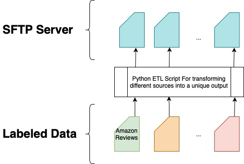

# File ETL - Readme



It's a Python based repository for an ETL to proceed data from files,
unify format through different file sources and send them to an
Apache Kafka broker for getting proceed for different usecases.

## Requirements & Setup
There are different setup options:
1. Use pure Python & Python packages
2. Use Docker & Docker Compose

### Requirements
- Python 3.7 or higher
- poetry or pip (I do recommend poetry, not only for this project but
    also in general)
- Docker & Docker Compose (optional)
- Running Kafka Cluster & Kafka Connect (Optional - just required if
    the generalized data should be proceed into a database)

### Setup

**Docker**
In this repository are two docker-compositions included:
- docker-compose
- docker-compose-sampleset

The sampleset will use the prepared sample data for ETL process.
The usual dockerfile will try to put the real data (if provided)
into the pipeline.

**Python**
1. Create & activate a virtual environment (optional but highly
    recommended)
```
virtualenv venv
source venv/bin/activate
```

2. install requirements
```
poetry install
```
if you are not using poetry, you can use aby package manager by
installing the requirements. e.g.
```
pip install -r requirements.txt
```

3. Create an env file and set properties:
```
cp etl/.env.example etl/.env
```
- `LOG_LEVEL` [`str`]: choices: `DEBUG`, `INFO`, `WARNING`, `ERROR`,
    default: `INFO`
- `LANGUAGE_PROPABILITY_TRESHOLD` [`float`]: the python package
    `langdetect` is used for language detection. The method which is
    in used will always give a propability for an language back to
    the user. The treshold is the lowest allowed propability for the
    detected language.
- `STEMMING_REQUIRED` [`bool`]: if True: each text will be stemmed
    with `nltk.stem.lancaster.LancasterStemmer`, if False no stemming
    will be included.
- `SFTP_HOSTNAME` [`str`]: Host for external server
- `SFTP_PORT` [`int`]: Port for external server
- `SFTP_USERNAME` [`str`]: username for external server
- `SFTP_PASSWORD` [`str`]: password for external server


4. start the application
```
python etl/main.py <run mode> \
    [:optional --sources] \
    [:optional --allowed-threads] \
    [:optional --chunk-size] \
    [:optional --copy-to-sftp]
```
- run mode: `run` for running the application in production, `demo`
    for running the application for test purposes
- sources [`str`]: comma separated list of sources you want to put in
    the etl. if not set: all sources will be executed
- allowed-threads [`int`]: number of threads which should be parallelized
    if not set: one thread is in used
- chunk-size [`int`]: size of chunks which are read from dataset
    if not set: full dataset will be loaded at once
- copy-to-sftp [`bool`]: if True: data will be copied to external server
    if not set: False per default

**Demo Command**

```
python etl/main.py dummy \
    --sources=amazon_reviews \
    --allowed-threads=4 \
    --chunk-size=100 \
    --copy-to-sftp=True
```

## General
For running this script, you need to have some infos in mind:

### Prepare data for your etl processes
Each etl process should contain a directory called `data` with real
data to proceed. This Repository provides a small dataset for test
purposes which you can execute in `demo` mode.

### Server
`pysftp` is used for copying the output to an additional server. Make
sure this server is running if you like to copy the created data into
it.

### Kafka
Apache Kafka is not part of this repository. This repository is a
microservice which is usable without Kafka & SFTP.

## Output
- `source` - where does the data comes from
- `type` - positive / negative / neutral
- `header` - short header of review [`default: ""`]
- `body` - body of review
- `is_streaming` - boolean for logical purposes inside of Kafka
- `language` - language code for text - currently only english

## Sources
- [Amazon Review Dataset](https://drive.google.com/drive/folders/0Bz8a_Dbh9Qhbfll6bVpmNUtUcFdjYmF2SEpmZUZUcVNiMUw1TWN6RDV3a0JHT3kxLVhVR2M?resourcekey=0-TLwzfR2O-D2aPitmn5o9VQ)

## Workflow
ETL Flow will happens in two steps:
1. Load Source data, bring them into a specific CSV format
2. Consume that CSV with a Kafka Connector for getting automatically
    proceed into the kafka topic

The files wont get proceed directly into the broker.
That may allows to have some general format changes at a later point
of that project without rerunning the whole ETL process which might
take some time to proceed. Another use case could be that the data
simply needs to get reproceeded at some point and we might not run
the whole ETL process again.

## Tutorial - include a new source
1. Create the new source skeleton
```
cp -a etl/utils/source_skeleton etl/<NewSourceName>
```

2. register your source in `etl/configs/sources`
```
SOURCES = (
    ...,
    <NewSourceName>
)
```

3. Write your etl process. It's important that the output will
    covering the required format.


## Tests
The application is tested by using `pytest`. Run tests by typing
```
poetry run pytest
```

Only an expectation test is included:
- test if the expected output matches the real output for each source


## Known Bugs
1. **Threading & Chunking**

The source data will be read in chunks if `chunk-size` is set. This
allows to parallelize the etl and allows to read datasets which are
greater than the local RAM. The chunks are realized via generator
function. The bug comes with multi threading:

If threading is greater than 1, the chunks are still realized by
generator function but the full dataset will be loaded at once.

2. **CMD Parameter `copy-to-sftp`**

It will be always interpret as `True` if set and `False` if not.
